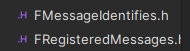
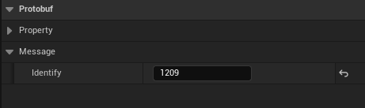
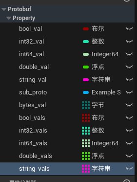
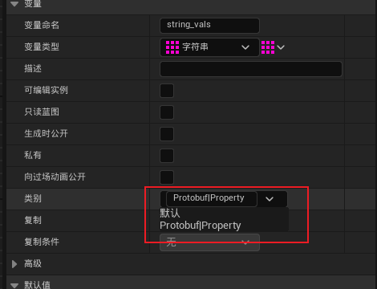

# ProtobufBlueprintSp

一个能让Protobuf在蓝图中使用的插件

------

## 支持类型

### 单一类型

|         proto         |          蓝图           |          U++           |
| :-------------------: |:---------------------:|:----------------------:|
| int32/sint32/sfixed32 |         int32         |         int32          |
| int64/sint64/sfixed64 |         int64         |         int64          |
|    uint32/fixed32     |           -           |         uint32         |
|    uint64/fixed64     |           -           |         uint64         |
|        double         |        double         |         double         |
|         float         |           -           |         float          |
|         bool          |         bool          |          bool          |
|         enum          |         enum          |         uint8          |
|        string         | string/TArray\<uint8> | FString/TArray\<uint8> |
|         bytes         |    TArray\<uint8>     |     TArray\<uint8>     |
|        message        | UProtobufMessage蓝图子类  |   UProtobufMessage*    |
|          map          |           -           |           -            |

### 数组类型(repeated)

|         proto         |              蓝图               |            U++             |
| :-------------------: |:-----------------------------:|:--------------------------:|
| int32/sint32/sfixed32 |        TArray\<int32>         |       TArray\<int32>       |
| int64/sint64/sfixed64 |        TArray\<int64>         |       TArray\<int64>       |
|    uint32/fixed32     |               -               |      TArray\<uint32>       |
|    uint64/fixed64     |               -               |      TArray\<uint64>       |
|        double         |        TArray\<double>        |      TArray\<double>       |
|         float         |        TArray\<float>         |       TArray\<float>       |
|         bool          |         TArray\<bool>         |       TArray\<bool>        |
|         enum          |         TArray\<enum>         |       TArray\<uint8>       |
|        string         |       TArray\<FString>        |      TArray\<FString>      |
|         bytes         |               -               |             -              |
|        message        | TArray\<UProtobufMessage蓝图子类> | TArray\<UProtobufMessage*> |

------

## 使用方法

1. 编写`.proto`文件

2. 使用`protoc.exe`生成`.pb.h`和`.pb.cc`文件

3. 在以下文件里注册新生成的消息

   

4. 蓝图派生`ProtobufMessage`类

5. 在**类默认值**里编辑标识符(新添加消息的标识符)

   

6. 蓝图添加`proto`文件里的变量([详情请看](#2. 蓝图变量分类))

7. 之后就可以调用函数进行序列化和反序列化等操作了( •̀ ω •́ )✧

   - 相关函数在`Protobuf|Util`分类下

------

## 注意事项

### 1. proto变量命名

`proto`文件中的变量名称需要为**snake_case**风格

例如：.proto文件如下：

```protobuf
syntax = "proto3";

message TestMessageReq {
  bool bool_val = 1;
  int32 int32_val = 2;
  int64 int64_val = 3;
  double double_val = 4;
  string string_val = 5;
  bytes bytes_val = 6;
  repeated bool bool_vals = 7;
  repeated int32 int32_vals = 8;
  repeated int64 int64_vals = 9;
  repeated double double_vals = 10;
  repeated string string_vals = 11;
  repeated bytes bytes_vals = 12;
}
```

------

### 2. 蓝图变量分类

继承自`ProtobufMessage`的蓝图类在对`proto`消息变量创建时，需要将变量放至**Protobuf|Property**分类下

```
Protobuf|Property
```





------

